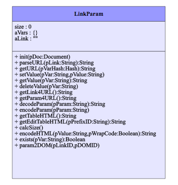

## Javascript Class: LinkParam
created Javascript Class Creator JSCC 2017/11/14 11:37:47
https://niebert.github.io/JavascriptClassCreator
File: js/linkparam.js

### Attributes: LinkParam

#### size:Integer
* Default value: 0
* Visibility: public
* Comment: Counts the Number of Parameter

#### aVars:Hash
* Default value: {}
* Visibility: public
* Comment: Attribute: 'aVars' Type: 'Hash' stores all URL parameters 

#### aLink:String
* Default value: ""
* Visibility: public
* Comment: Attribute: 'aLink' Type: 'String' stores the Link before '?' 

### Methods: LinkParam

#### init(pDoc:Document)
* Visibility: public
init extract the link with parameters from document.location.search and store aLink) 

#### parseURL(pLink:String):String
* Return Type: :String
* Visibility: public
parses the URL stores the variables in 'aVar' e.g. ..&lastname=Niehaus&... stores aVars['name']='Niehaus'):String 

#### getURL(pVarHash:Hash):String
* Return Type: :String
* Visibility: public
Comment for getLink):String 

#### setValue(pVar:String,pValue:String)
* Visibility: public
sets the value of a link parameter, this is useful
when a parameter for URL are generated from the link parameters
defined in LinkParam) 

#### getValue(pVar:String):String
* Return Type: :String
* Visibility: public
Comment for getValue(pVar) return the definition of the parameter exists otherwise en empty string):String 

#### deleteValue(pVar:String)
* Visibility: public
Comment for deleteValue in the parameter hash aVars
return a Boolean if delete was sucessful, resp. variable pVar exists in Hash aVars) 

#### getLink4URL():String
* Return Type: :String
* Visibility: public
get the Link part of the URL without the URL parameters):String 

#### getParam4URL():String
* Return Type: :String
* Visibility: public
get the parameter string for the URL starting with ? if aVars contains variables):String 

#### decodeParam(pParam:String):String
* Return Type: :String
* Visibility: public
decode a parameter from the URL):String 

#### encodeParam(pParam:String)
* Visibility: public
encode a parameter for a call from the app.) 

#### getTableHTML():String
* Return Type: :String
* Visibility: public
creates a HTML table with two column for key and value of the parameter hash aVars):String 

#### getEditTableHTML(pPrefixID:String):String
* Return Type: :String
* Visibility: public
creates a Edit HTML table with two column for key and value of the parameter hash aVars.
The keys of aVars are used as IDs for the HTML form. An optional ID prefix as parameter can be used to create a unique ID for the DOM elements- All parameters are visible in an input field.):String 

#### calcSize()
* Visibility: public
calculates the number of variables defined in the URL parameters, stores result in length) 

#### encodeHTML(pValue:String,pWrapCode:Boolean):String
* Return Type: :String
* Visibility: public
Encodes source code for HTML-Output in as code or textarea in the following way:
 1) Replace "&" character with "&amp;"
 2) Replace "<" character with "&lt;"
 3) Replace ">" character with "&gt;"
<<<<<<< Updated upstream
The converted pValue will wrapped with &lt;pre&gt; and &lt;code&gt; tags for direct display as HTML and without code tag wrapper if the code is written as inner HTML and value to a textarea. 
=======
The converted pValue will wrapped with "pre" and "code" tags for direct display as HTML 
and without code tag wrapper if the code is written as inner HTML and value to a textarea.):String 
>>>>>>> Stashed changes

#### exists(pVar:String):Boolean
* Return Type: :Boolean
* Visibility: public
<<<<<<< Updated upstream
checks if the parameter with variable 'pVar' exists in parameter hash this.aVars
=======
checks if the parameter with variable 'pVar' exists in parameter hash this.aVars):Boolean 

#### param2DOM(pLinkID:String,pDOMID:String,pOutType:String)
* Visibility: public
param2DOM(pLinkID,pDOMID) read the Link Parameter of the pLinkID if exists and 
- (html) writes the content to innerHTML (pOutType='html') of DOM node pDOMID or
- (val) writes the content to the value of the HTML input object with the ID pDOMID  ) 
>>>>>>> Stashed changes
